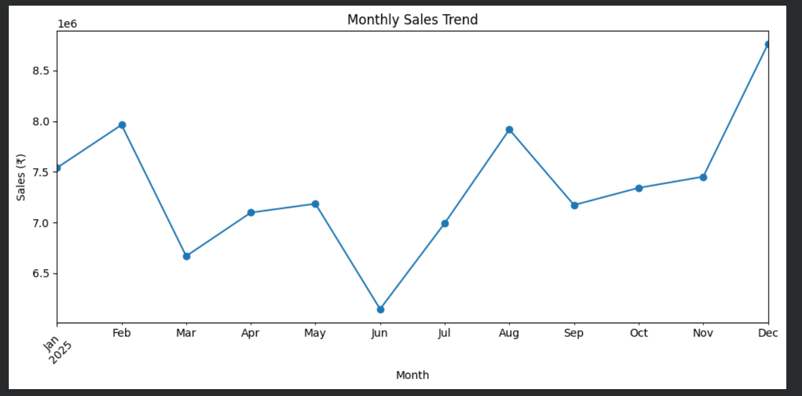

# ShopEase E-Commerce Sales & Customer Analytics

E-commerce sales and customer analysis using Python, Pandas, and Matplotlib.

## 📌 Project Overview

ShopEase is an e-commerce company that wants to understand its sales performance, customer behavior, product performance, and payment preferences.

This project analyzes ShopEase's sales data to identify business trends, high-performing products, customer patterns, and opportunities for improvement.

## 🎯 Business Question

**How is our business performing, what is driving sales, and where are we losing opportunities?**

## 🎯 Objectives

- Analyze overall sales performance
- Identify high-performing products and categories
- Understand monthly sales trends
- Compare sales across cities
- Identify high-value customers
- Analyze payment method preferences
- Evaluate sales across discount levels
- Provide actionable business recommendations

## 🛠️ Tools & Technologies

- Python
- Pandas
- Matplotlib
- Google Colab
- Jupyter Notebook

## 📊 Key Results

| KPI | Value |
|---|---:|
| Total Sales | ₹88,237,535 |
| Total Orders | 3,000 |
| Total Customers | 774 |
| Total Quantity Sold | 9,089 |
| Average Order Value | ₹29,412.51 |

## 🔍 Key Insights

### Product Performance
- Laptop generated the highest sales at approximately ₹3.64 crore.
- Smartphone generated the second-highest sales at approximately ₹2.62 crore.
- Some products had high quantities sold but relatively lower revenue.

### Category Performance
- Electronics was the strongest category with approximately ₹7.05 crore in sales.
- Clothing had high order volume but a much lower average order value.
- Accessories was the weakest category by sales.

### Monthly Sales
- December recorded the highest monthly sales at approximately ₹87.59 lakh.
- June recorded the lowest monthly sales at approximately ₹61.47 lakh.
- Sales fluctuated throughout the year.

### City Performance
- Delhi generated the highest sales at approximately ₹1.03 crore.
- Kolkata was the second-highest city at approximately ₹99.79 lakh.
- Bengaluru had the lowest sales among the major cities.

### Customer Analysis
- Customer 2338 generated the highest individual customer sales at ₹6.74 lakh.
- High-value customers can be targeted through loyalty and personalized offers.

### Payment Methods
- UPI was the most-used payment method and generated the highest total sales.
- Credit Card had the highest average order value.

### Discount Analysis
- Orders and sales were highest at the 0% discount level.
- Higher discount levels were associated with lower order volume and sales in this dataset.
- This relationship does not prove that higher discounts cause lower sales.

## 💡 Business Recommendations

- Prioritize Laptop and Smartphone inventory and marketing.
- Investigate opportunities to improve weaker products such as Backpack and T-Shirt.
- Continue investing in the Electronics category.
- Investigate the reasons behind the December sales peak and June decline.
- Create loyalty strategies for high-value customers.
- Continue supporting UPI while maintaining multiple payment options.
- Test targeted discounts instead of applying large discounts broadly.

## 📁 Project Files

- `ShopEase_Ecommerce_Analytics.ipynb` — Complete Python analysis
- `shopease_sales_data.csv` — Dataset used for the analysis

## 👩‍💻 Author

Varshini

## 📈 Monthly Sales Trend

